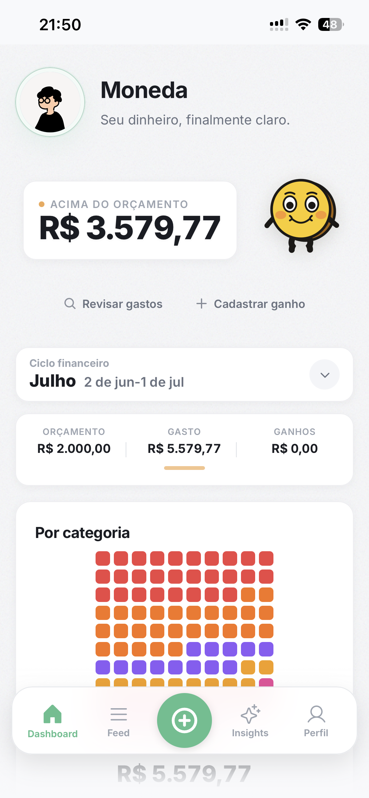
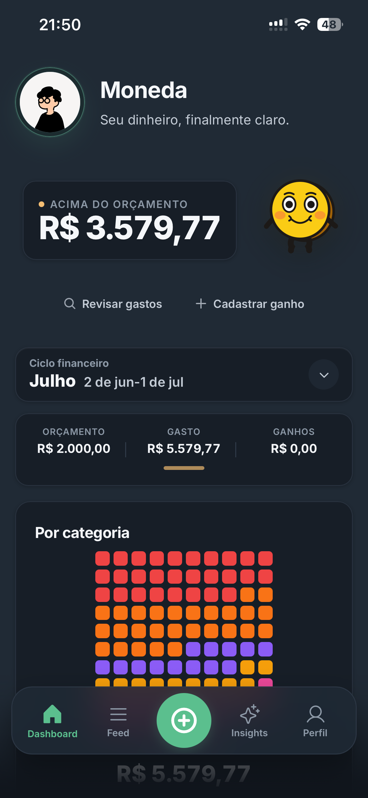

<p align="center">
  
</p>

<h1 align="center">Moneda</h1>

<p align="center"><em>"Seu dinheiro, finalmente claro."</em></p>

<p align="center">
  Assistente financeiro pessoal com IA. Lance gastos em linguagem natural, receba insights que explicam o seu dinheiro e entenda para onde ele vai — sem planilhas e sem julgamentos.
</p>

---

## Visão geral

Moneda é um app de controle de gastos pessoal voltado para o brasileiro. A premissa: lançar um gasto deve levar menos de 60 segundos. Você escreve em português natural — _"almoço 35 ifood"_ — e a IA categoriza, registra e devolve um resumo que **explica** o seu dinheiro em vez de só mostrar gráficos.

Hoje o produto roda como uma **PWA** (dashboard + insights com IA), com modo claro/escuro, ciclo de cartão e fechamento no padrão brasileiro. O norte do projeto é levar essa experiência para o **WhatsApp**, onde o público-alvo já vive.

## Screenshot

<table align="center">
  <tr>
    <td align="center"></td>
    <td align="center"></td>
  </tr>
  <tr>
    <td align="center">Modo claro</td>
    <td align="center">Modo escuro</td>
  </tr>
</table>

## Funcionalidades

- **Lançamento em linguagem natural** — texto livre categorizado por IA (Groq)
- **Dashboard claro** de orçamento, saldo e progresso de gastos
- **Insights com IA** — resumos mensais, alertas de padrão e dicas personalizadas
- **Ciclo de cartão e fechamento** modelados no padrão brasileiro
- **PWA instalável** com tema claro/escuro
- **Privacidade por padrão** — mascaramento de valores sensíveis e auditoria de PII

## Stack

| Camada | Tecnologia |
| --- | --- |
| Framework | Next.js 16 (App Router, RSC) |
| Linguagem | TypeScript (strict) |
| UI | React 19, Tailwind CSS v4, Phosphor Icons, Framer Motion |
| Gráficos / efeitos | Three.js + React Three Fiber |
| Banco & Auth | Supabase (Postgres, RLS, cookies SSR) |
| IA | Groq API (`llama-3.1-8b-instant`, `llama-3.3-70b-versatile`) |
| PWA | manifest + service worker |
| Deploy | Vercel — [moneda.info](https://moneda.info) |

## Primeiros passos

### Pré-requisitos

- Node.js 20+
- Um projeto [Supabase](https://supabase.com) (URL + chaves)
- Uma chave da [Groq API](https://console.groq.com)

### Instalar

```bash
npm install
```

### Variáveis de ambiente

Crie `.env.local` na raiz do projeto:

```bash
# IA — Groq
GROQ_API_KEY=gsk_...

# Supabase (banco + auth)
NEXT_PUBLIC_SUPABASE_URL=https://<project>.supabase.co
NEXT_PUBLIC_SUPABASE_PUBLISHABLE_KEY=eyJ...
SUPABASE_SERVICE_ROLE_KEY=eyJ...

# App
NEXT_PUBLIC_WHATSAPP_URL=          # opcional (integração WhatsApp)
```

### Rodar em desenvolvimento

```bash
npm run dev
```

Acesse [http://localhost:3000](http://localhost:3000).

> [!TIP]
> Outros scripts úteis: `npm run typecheck`, `npm run build`, `npm test`, `npm run screenshots`, `npm run security:audit`, `npm run security:secrets`.

## Estrutura

```
moneda/
├── src/
│   ├── app/                # Next.js App Router
│   │   ├── (app)/          # Dashboard, feed, insights, perfil
│   │   ├── (auth)/         # Login e signup
│   │   ├── api/            # Routes: ai, expenses, dashboard, export, pii...
│   │   ├── onboarding/
│   │   └── auth/callback/
│   ├── components/         # UI, dashboard, layout
│   ├── context/            # Estado compartilhado
│   ├── data/               # Acesso a dados
│   ├── hooks/
│   ├── lib/                # supabase, groq, utils
│   ├── proxy.ts            # Middleware de auth/redirect
│   └── types/
├── public/                 # Logo, ícones PWA, manifest, service worker
├── supabase/               # Migrations e schema
├── scripts/                # Screenshots, backfill de PII
├── tests/
├── DESIGN.md  PRODUCT.md  ARCHITECTURE.md  DATABASE.md  PWA.md
└── package.json
```

## Documentação

| Documento | O que cobre |
| --- | --- |
| [PRODUCT.md](PRODUCT.md) | Visão de produto, personas, proposta de valor e KPIs |
| [ARCHITECTURE.md](ARCHITECTURE.md) | Stack, estrutura de pastas, fluxos (WhatsApp, IA) e decisões técnicas |
| [DESIGN.md](DESIGN.md) | Design system: tokens, cores, componentes e guia visual |
| [DATABASE.md](DATABASE.md) | Schema Supabase, migrations, RLS e plano de evolução |
| [PWA.md](PWA.md) | Configuração e estratégia de PWA |

## Status

> [!NOTE]
> **MVP 1** em produção. Dashboard com banco real, autenticação Supabase e deploy na Vercel. Integração WhatsApp em andamento.

- [x] Dashboard, feed e insights com gráficos
- [x] Autenticação (Supabase) e onboarding
- [x] PWA configurada e instalável
- [x] Modo claro/escuro
- [x] Deploy em [moneda.info](https://moneda.info)
- [ ] Integração WhatsApp (Evolution API / WAHA)
